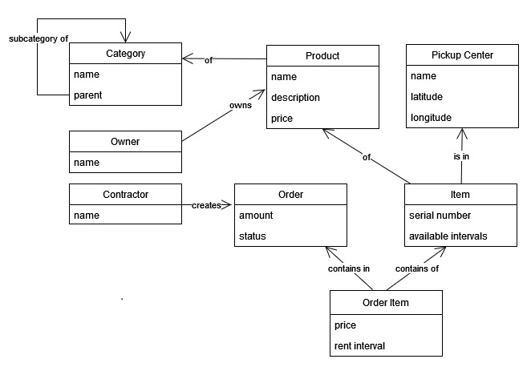

= RentShop

This project is created to compare *JPA* vs *Reactive*  to
work with a relational database (*PostgreSQL*) on a standard task of
managing a cart with products for renting.

The project uses *Spring Boot*, *Spring Framework* (*Web MVC*, *WebFlux*),
*Spring Data* (*JPA*,*R2DBC*).

Let's describe the main entities of the model.

*Product* is what is rented.

*Item* is an *product* instance that can be rented.

*Contractor* is the one who rents the product.

*Order* (a cart) is created by a *contractor* to added *products* for renting.
Each *product* may have its own rental period.
While the *order* is not completed  the *contractor* can add or remove *products*.
As soon as the *order* is completed, the *contractor* starts using these *products*.
Once all *products* have been returned, the *order* will be closed.

Below is a diagram of the main entities.

The project uses *Spring Framework* and *maven*.

The project contains 3 modules.

Module `jpa`  implements *JPA* approach and uses *Spring Boot*,*Spring Web MVC*,
*Spring Data* *JPA*.

Module `react` implements *React* approach and uses *Spring Boot*, *Spring WebFlux*,
*Spring Data R2DBC*.

Module `common` contains common classes.

The database is *PostgreSQL 14.3*. The script for creating the database
and objects is

`common\src\main\resources\create_postgres_db.sql`

